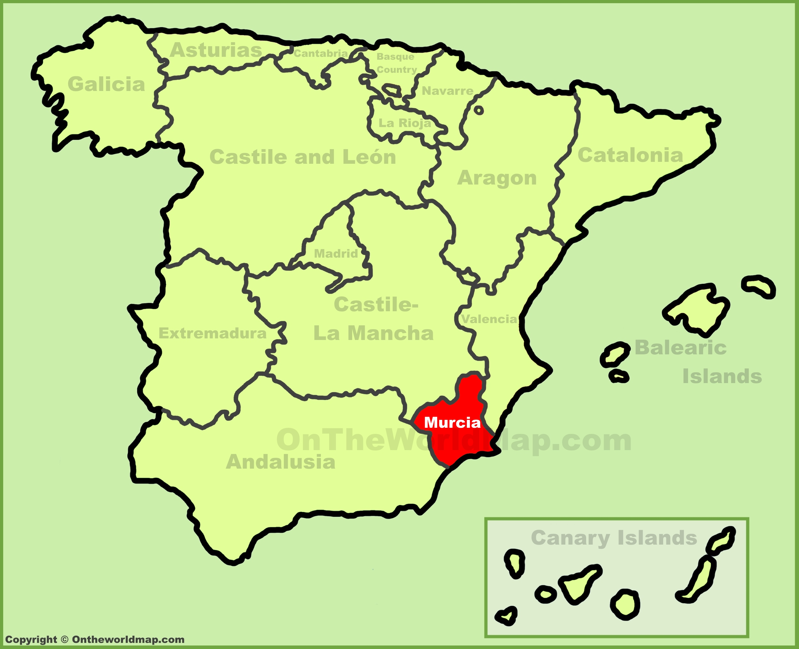
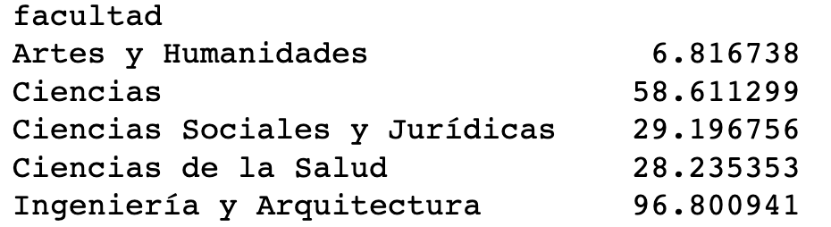
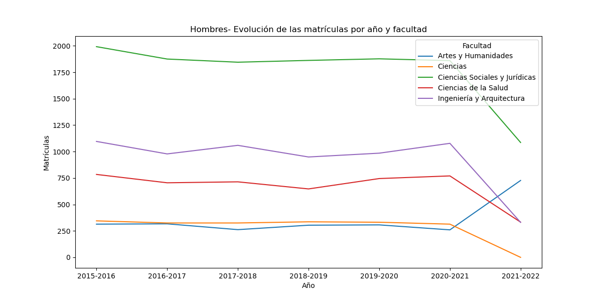
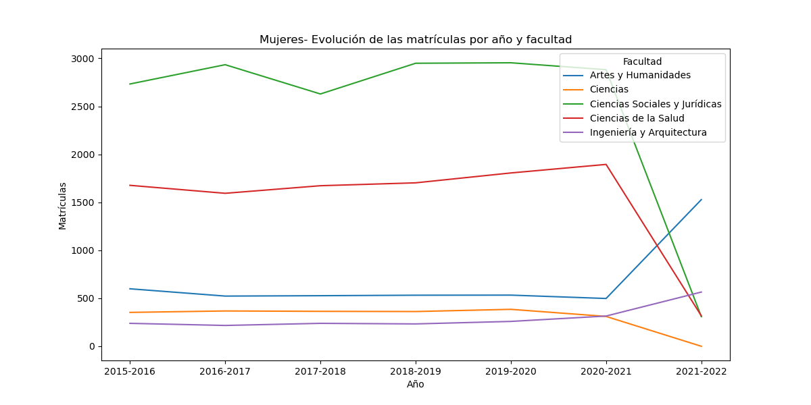
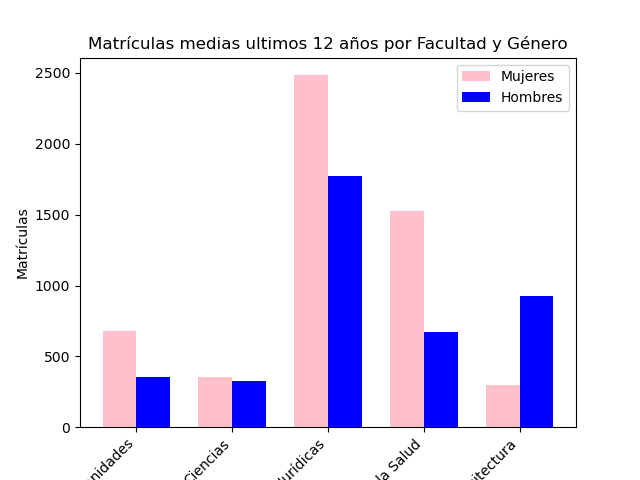
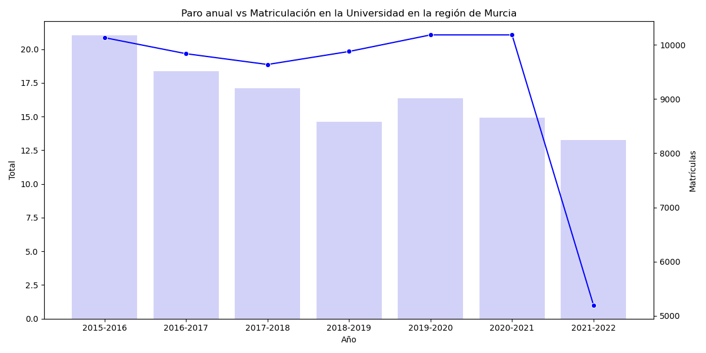
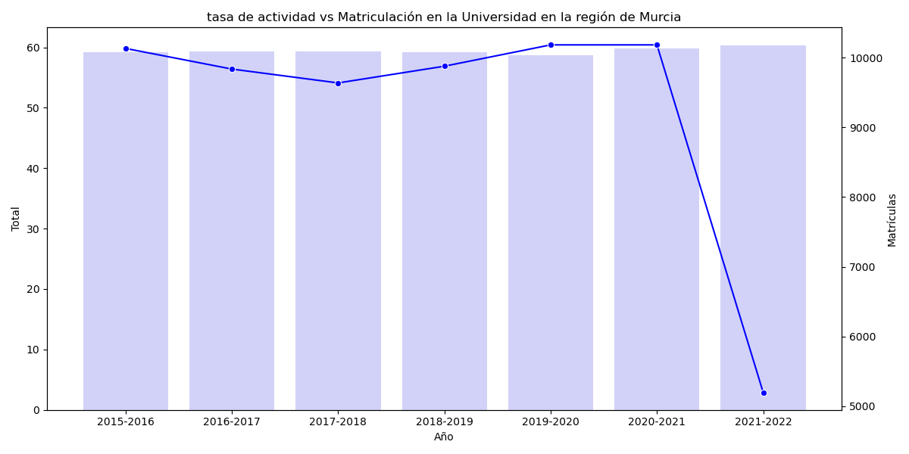
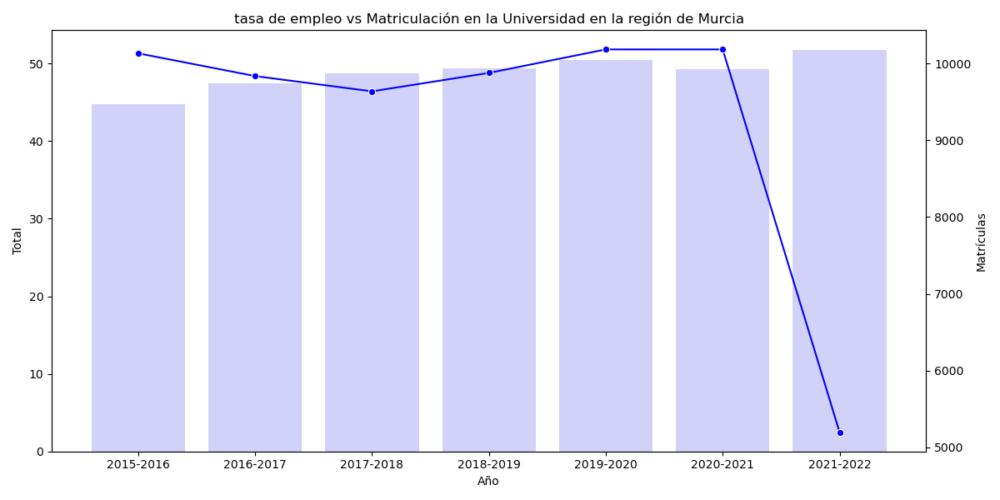

# ¿Por qué suben las notas de selectividad sin control?

En este analisis prentendo encontrar alguna explicación mejor a la que nos ofrecía la noticia del enlace del por qué están subiendo las notas de acceso a la universidad a ritmos escandalosos. 

Un informe revela las razones por las que han subido las notas de Selectividad

En los últimos años la nota media de la Selectividad ha aumentado de un 8,75 sobre 14 en 2015/2016 a un 10,34 en 2021/2022. Este aumento se observa en todas las comunidades autónomas, pero ¿cuáles han sido las razones?.

https://www.ondacero.es/noticias/sociedad/informe-revela-razones-que-han-subido-notas-selectividad_20230614648978f481ae4c0001321a26.html

# Me centro en una región.

Murcia que "bonica" eres. El estudio lo voy a realizar en una sola región. He elegido Murcia porque en la ultima década no ha sufrido cambios ni en su oferta académica, ni en su oferta institucional formada por tres universidades: Universidad de Murcia (Pública), Universidad Politécnica de Cartagena(Pública) y la Universidad Católica San Antonio de Murcia(Privada)

Esta decisión evita posibles cambios relacionados con la oferta de plazas, la oferta de titulos y la entrada de nuevos competidores

# PASO 1. Extraer los datos de selectividad

Encontrar los resultados de selectividad es relativamente sencillo. No obstante, lo que quería era centrarme en Murcia y para ellos scrapee los datos de la pagina de la Universidad de Murcia ya que por tamaño es la que ofrece mayor cantidad de titulos. 

# PASO 2. El primer CSV- Las matriculas universitarias españolas

lo primero que hice fue descargar un archivo del Ministerio de Universidades. Ese CSV tuve que limpiarlo ya que tenía todos los datos de matriculas en los diferentes grados, tipos de universidades, tipología de estudios, tipo de formato de estudios, por genero, año y región de españa. 
Este documento no fue sencillo ya que el csv requería de mucha limpieza del dato y reestructuración del mismo. 

# Paso 3. Alimentar los datos
Pero claro, los datos de selectividad y las matriculas no decían demasiado, y además tiene sentido que vayan a la par, por lo que busqué mezclarlos con el mercado de trabajo. Con esto pretendo ver que la oferta o demanda de empleo puede generar mayor demanda de acceso a la universidad y por tanto un incremento en la nota media. 

# En mi trabajo verás un conjunto de carpetas donde está el trabajo de limpieza y analisis. 

Carpeta de NOTEBOOKS

0.1 scrapeo_selectividad.ipynb: extraccion de los datos de selectividad de la universidad de Murcia

1.1 limpiezacsv.ipynb:  Limpieza del csv obtenido en el ministerio de universidades. Aqui verás mucho trabajo de limpieza de columnas y filas. Fue un proceso lento y de aprendizaje ya que el formato inicial era la muerte a pellizcos

1.2 limpieza-por-sectores.ipynb: Una vez limpios los datos tuve que ordenarlos para poder extraer los datos necesarios

1.3 limpieza_maxima.ipynb: Como resutaldo final de todo el trabajo consigo extraer los datos sólo para la región de Murcia

2.1 scrapeo_ine.ipynb: Scrapeo con Selenium los datos del INE. 

2.2 limpieza_ine.ipynb: Limpio esos datos para generar un CSV

3.1 sql.ipynb: Trabajo de carga y creación de tablas en SQL "lamentablemente no está acabado con exito"

4.1 graficos.ipynb: Graficos que ayudan a la comprensión del resultado final y el analisis 

 Carpeta DATA
0 datos_universidades
    0.0 2_2_NI_Sex_Nac_Rama_CAsc.csv CSV Bruto
    0.1 datos_murcia.csv Extraccion de los datos de Murcia para todas las nacionalidades
    0.2 datos_murcia_esp.csv Extraccion de los datos de Murcia solo para españoles
    0.3 df_super_murcia.csv datos limpios
1 ine
    1.0 ine_murcia.csv Extraccion de los datos del scrapeo
    1.1 limpieza_csv Trabajo de limpieza
    1.2 df_ine_murcia_limpio.csv resultado limpio
   
2 selectividad
    2.0 dt_selectividad_murcia.csv Datos escrapeados y limpios

# Vamos a entenderlo todo..
Todo empezó con esta premisa.

Tras todo el trabajo, lo primero que hacemos es ver que efectivamente las notas de corte de selectividad han incrementado en todas las facultades año tras año. Esto era lo que nos planteaba el articulo del principio. Pero que ha pasado para que ocurra semenjante locura 

visto así no tiene sentido por eso vamos a ver si ha pasado algo con la oferta de plazas, un motivo claro de una posible subida de notas; a menos plazas y misma demanda de las mismas, mas competencia. 

 
como vemos ni los hombres ni las mujeres han sufrido variaciones grandes año tras año. Y ya que tenemos estos datos delante, que curioso que las mujeres siempre superan a los hombres en todas las facultades menos en tecnología. 

y claro nos quedaría saber que ha pasado con el mercado laboral. Ha sufrido muchos cambios??
Pues no. Ni el paro, ni el empleo, ni la tasa de actividad han sufrido cambios grandes.

Entonces que ha pasado??

# conclusiones. 

Lamentandolo mucho no podemos sacar ninguna conclusión de por qué las notas de selectividad crecen sin parar. Lo que queda claro es que ni el mercado de trabajo ni la oferta se ha visto modificada sensiblemente y que los crecimientos son tremendos. 
Debemos entonces pensar que el nivel académico en la educación obligatoria secundaria y bachiller ha bajado como sugiere el informe....me temo que si. 

"Los investigadores concluyen que la hipótesis de la competición pesa tanto como la de la inflación para explicar la subida
De esta manera, explican, los datos sobre la Selectividad de casi un millón y medio de estudiantes que la realizaron entre 2013 y 2020,y que muestran que el aumento de las calificaciones se explica a la vez por "la emergencia de un entorno cada vez más competitivo y por una dinámica inflacionaria de las notas fruto de decisiones políticas".

El cambio crucial de una Selectividad a 10 a 14 gracias a la creación de la prueba específica (optativa), la subida simultánea de las notas de corte, el aumento del volumen de estudiantes que se presenta y que además aspira a las notas más altas, han creado un entorno de competitividad que, por ejemplo, ha llevado al 92% en 2022 a realizar una parte de la prueba que se creó en 2010 como opcional."

# ¿y que nos queda?
1- Hacer el mismo ejercicio para todas las provincias y ver si en alguna de ellas hay algún patrón diferente y revatir así el articulo.
2- Utilizar de forma correcta SQL
3- Poder realizar un pipeline y crear un proyecto con estructura.
4-automatizar, generar mayor cantidad de funciones

